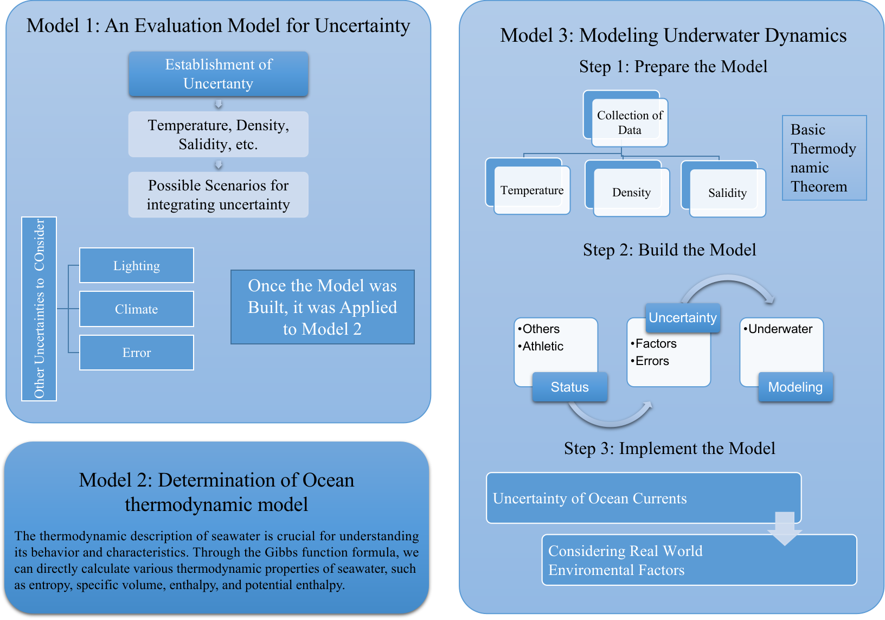

---
bibliography:
- bib.bib
---

::: center
**Journey to the Rescue:\
Submersibles in the Deep Sea**
:::

::: center
**Summary**
:::

There has always been great interest in the exploration of the oceans,
and submersibles have been developed to investigate these vast and
enigmatic regions. However, there are inherent risks associated with
submersible exploration, especially in unknown and deep ocean
environments. As the depth of exploration increases, so does the
likelihood of submersible malfunctions. Thus, this paper aims to enhance
the search and rescue capabilities for lost submersibles by developing a
localization model to predict their locations. By considering the
pre-accident uncertainty, we select appropriate equipment to mitigate
this uncertainty.

To address problem 1, we introduce a dynamic model of the submersible
underwater, simplifying it into a capsule-like structure for analysis.
By examining the forces acting upon the submersible, we derive
differential equations governing its velocity along three axes, which
provide a representation of its position over time. Additionally, we
evaluate the factors that may contribute to accidents and develop a
model for uncertainty assessment. To assess the probability of the
submersible's position, we utilize the 3σ principle and the mathematical
significance of the normal distribution to calculate the potential
locations. Notably, we create an accurate 3D image of the submersible
using ArcGIS to enhance the precision of our results. Furthermore, we
suggest measures to minimize uncertainty and propose additional
equipment for submersible operations.

Regarding problem 2, we establish a comprehensive evaluation model based
on four indicators and employ hierarchical analysis with entropy
weighting to select the necessary equipment. This approach yields
weights for each alternative equipment option. Ultimately, we present an
integrated evaluation method and derive the selection weights of 0.1850,
0.2808, and 0.5342 for multibeam sonar, remotely operated vehicle (ROV),
and autonomous underwater vehicle (AUV), respectively.

For problem 3, we identify two potential states of a lost submersible
underwater and utilize the submersible underwater dynamics model to
construct a probabilistic model diagram. The model is approximated as a
circular column. We initiate the AUV from the center of the circular
table surface and employ a hybrid algorithm combining shortest path and
greedy approaches for the search and rescue algorithm. Finally, we
determine the probability of successful search and rescue as a function
of time elapsed since the submersible's loss.

Lastly, for problem 4, we gather data from the Caribbean Sea and
fine-tune the model parameters. We generate a positional model
illustrating the motion of the two submersibles and evaluate and project
the outcomes.

**Keywords:** *underwater kinematic modeling, normal distribution,
analytic hierarchy process (AHP), entropy weighting method (EWM),
shortest paths algorithm*

::: center
:::

# Introduction

## Problem Background

With the advancements in science and technology, mankind's exploration
of the ocean has extended beyond shallow waters to the depths of the
deep sea. Submersibles, being a vital tool and technological aid in
deep-sea exploration, have facilitated a greater understanding of the
ocean. Also known as underwater vehicles or submersible vessels, these
specially designed ships operate underwater. Unlike autonomous
underwater vehicles (AUVs) or remotely operated vehicles (ROVs),
submersibles require the support and transportation of large surface
vessels or platforms. They find applications in scientific research,
commercial activities, and military operations. Employing advanced
technology and instruments, they are capable of performing diverse tasks
such as deep-sea exploration, underwater research, oil and gas
exploration, underwater archaeology, and even rescue missions. Moreover,
submersibles enable long-term observations and data collection in the
deep sea, offering valuable information in areas like marine biology,
geology, and chemistry. Figure
[1](#fig:unmanned_submersible){reference-type="ref"
reference="fig:unmanned_submersible"} illustrates a prototype of one of
our hypothetical submersibles, created using Blender.

<figure id="fig:unmanned_submersible">

<figcaption>The submersible</figcaption>
</figure>

Nevertheless, alongside their advantages, submersibles face potential
challenges and failures during underwater navigation. Due to the
intricate and ever-changing deep-sea environment, locating and rescuing
a submerged vehicle that has lost contact underwater becomes exceedingly
arduous. Traditional positioning methods like the Global Positioning
System (GPS), sonar positioning, and inertial navigation systems are
restricted in deep-sea environments, often lacking the accuracy and
reliability necessary for practical needs. Additionally, submersibles
cannot ensure human survival. Therefore, immediate action must be taken
to rapidly locate and rescue personnel when contact with a submersible
is lost. A lost submersible may be influenced by deep-sea currents,
which have the potential to divert it from its intended path.
Furthermore, technical malfunctions or human operational errors may also
result in submersible malfunction or loss of communication, emphasizing
the vital role of precise positioning and rescue in such circumstances.

## Restatement of Problem

Maritime Cruises Mini-Submarines (MCMS) is a Greek company that designs
mini-subs for deep-sea exploration. They plan to utilize their mini-subs
for tourist expeditions in the Ionian Sea, specifically to explore
shipwreck remains. However, regulatory agencies require them to develop
safety procedures to prevent communication interruptions and potential
mechanical failures. More specifically:

1.  To predict and locate the mini-subs possible positions and
    trajectories in real time over some time, we need to establish a
    model that considers factors such as ocean currents, sea density,
    and underwater geography. The model should also account for the
    possibility of malfunctions, estimate and calculate the state of the
    mini-subs immediately after a malfunction occurs, address
    uncertainty issues, and determine the necessary equipment for the
    mini-subs while considering the regular transmission of information
    to the main vessel to reduce uncertainty. []{#problem1
    label="problem1"}

2.  Suggestions are proposed regarding the involvement of additional
    search devices and rescue vessels. Equipment choices that minimize
    uncertainty factors should be selected, taking into account
    equipment availability, maintenance costs, usage costs, and purchase
    costs. We need to comprehensively consider various aspects to
    optimize the equipment selection plan. []{#problem2
    label="problem2"}

3.  Establish a search model to suggest the initial deployment point and
    search pattern to minimize search time. This model should also
    evaluate the relationship between the probability of finding the
    mini-subs and time and cumulative search results. []{#problem3
    label="problem3"}

4.  The established positioning model should be expanded to consider its
    applicability to other tourist destinations such as the Caribbean
    Sea and other seas. It should also consider the probability of
    successfully locating the mini-subs when multiple mini-subs are
    operating in the same vicinity, by considering multiple positioning
    models. []{#problem4 label="problem4"}

## Literature Review

Researchers have proposed several underwater submersible localization
methods. Sonar localization technology, in particular, is widely used in
underwater search and rescue. Cheng et al. utilized time delay
difference for submersible positioning and converted sonar images into
sparse point cloud data, enhancing the utility of sonar by suppressing
inertial guidance drift [@PMID:35095458]. Additionally, positioning
methods based on communication signals, such as GPS and radio
positioning, are employed. [@{10.1016/s0034-4257(00)00092-4}] As
exploration depths increase, older positioning methods are gradually
being phased out while new methods are being introduced. Mandić et al.
improved a tracking filter that fuses USBL and multibeam sonar images
[@Underwater], and Harsdorf et al. pioneered a seafloor localization
technique combining range-gated imaging with fluorescent lidar for
remote classification of fluorescent material on the seafloor
[@Submarine].

Regarding search and rescue strategies, different approaches are
proposed for different causes of loss. For deep-sea SAR, due to the
complex high-pressure underwater environment, strategies involve
emergency recovery, tracking, and floating of submersibles. Chen Yunsai
established the \"counting-probing-fishing\" deep-sea rescue system.
Shallow sea search and rescue strategies mainly focus on locating lost
submersibles through search and localization technology, followed by
corresponding rescue actions [@1019146844.nh].

Furthermore, the application of artificial intelligence and machine
learning in the localization and search and rescue of lost submersibles
has been explored. Image recognition technology assists in determining
submersible location and status, while deep learning algorithms are used
for trajectory prediction [@10.1016/j.cola.2023.101199].

## Our work

In this issue, we need to locate the submersible and also suitably
launch search and rescue as soon as possible after the incident to
rescue the lost submersible faster. In this paper, our work focuses on
the following points:

{width="80%"}

1.  For problem [\[problem1\]](#problem1){reference-type="ref"
    reference="problem1"}, we developed a position prediction model to
    anticipate the potential locations of the submersible before and
    after the malfunction, considering factors such as ocean currents,
    ocean density, and seafloor geography. Given that the movement of
    the submersible on the seafloor is influenced by oceanic physical
    factors, we begin by determining the parameters of ocean
    thermodynamics to forecast seawater behavior. Next, we derive the
    relationship between the submersible's velocity and acceleration in
    three directions based on an underwater dynamics model. We then
    simplify the submersible into a capsule to analyze its motion
    trajectory. Finally, we construct an uncertainty model to predict
    the submersible's position probability.

2.  For Problem [\[problem2\]](#problem2){reference-type="ref"
    reference="problem2"}, we reviewed the information and selected
    three SAR equipment options: multibeam sonar, AUV, and ROV. To
    determine the best option, we need to assign weights to SAR
    capability, utilization-use cost, maintenance cost, and purchase
    cost in a balanced manner to minimize uncertainties. The integrated
    evaluation model of hierarchical analysis and entropy weighting is
    used to evaluate this three-object evaluation. An integrated model
    is then built for the evaluation method to assess the indexes from
    both subjective and objective perspectives, obtaining the weight
    ratio of the three types of SAR equipment.

3.  For Problem [\[problem3\]](#problem3){reference-type="ref"
    reference="problem3"}, we consider the position prediction model
    from Problem [\[problem1\]](#problem1){reference-type="ref"
    reference="problem1"} and the SAR equipment selected in Problem
    [\[problem2\]](#problem2){reference-type="ref"
    reference="problem2"}. We establish a SAR path that applies to
    various equipment using the shortest path algorithm and the greedy
    approach. Based on the experimental data, we conclude that our model
    can efficiently search and rescue a large area within a limited
    time, increasing the likelihood of recovering accident personnel.

4.  For Problem [\[problem4\]](#problem4){reference-type="ref"
    reference="problem4"}, we combined the aforementioned issues with
    the model. We collected data from the Caribbean Sea and other sea
    areas, analyzed it, and substituted it into the model to obtain
    better ideas and ways to modify it. As a result, we were able to
    build a model that works in most sea areas. The effect of the wake
    is calculated based on the momentum theorem by the new model.
    Subsequently, it is analyzed for multiple submersibles using the
    multi-objective model and genetic algorithm.

# Assumptions and Justifications

In conducting the positioning and search operations of underwater
submersibles, we need to establish some assumptions and provide
corresponding evidence. These assumptions help guide our work and ensure
the reliability and practicality of our models and strategies.

-   **Assumption 1:** The position of the submersible can be accurately
    measured through sensors and measurement devices.\
    **Justification 1:** Modern underwater submersibles are equipped
    with various sensors and measurement devices, such as sonar, depth
    gauges, compasses, etc., which can provide accurate position and
    motion information.

-   **Assumption 2:** The movement of seawater only involves horizontal
    currents and does not involve vertical turbulence.\
    **Justification 2:** The marine environment has complex fluid
    dynamics characteristics, including unstable longitudinal and
    transverse flows, turbulent eddies, and topography.

-   **Assumption 3:** It is assumed that there is no deviation
    displacement caused by collisions in the sea for the submersible.\
    **Justification 3:** The probability of collision with other large
    objects, such as whales, rocks, sharks, etc., in the ocean for the
    submersible is extremely small and can be neglected. Therefore, the
    deviation displacement caused by collisions has not been considered.

-   **Assumption 4:** The state of the submersible is influenced by the
    ocean and does not consider the impact of personnel and instruments
    inside the submersible on its state.\
    **Justification 4:** The ocean is a vast and complex environment
    that contains various factors such as ocean currents, pressure,
    temperature, etc., which directly affect the state of the
    submersible. In comparison, the impact of personnel and instruments
    inside the submersible on its state is relatively small and can be
    neglected.

# Notation

All symbols used in this paper are defined in Table
[1](#tab:notation){reference-type="ref" reference="tab:notation"}.

::: {#tab:notation}
   Symbols                       Description
  ---------- ---------------------------------------------------
     $p$                    Pressure in seawater
   $\theta$          Sea water conservative temperature
     $S$                     Sea water salinity
    $h_0$                    Potential enthalpy
    $\mu$     Relative chemical formula of salinity in seawater
     $T$                    Sea water temperature
    $\rho$                    Sea water density
     $h$                      Specific enthalpy
   $\sigma$                   Specific entropy
     $m$                     Submersible quality

  : Notation Table
:::

[]{#tab:notation label="tab:notation"}

# The Data

## Data Collection

Data collection and processing are crucial steps in the positioning
algorithm and search and rescue strategy of underwater vehicles. Only
accurate and complete data can provide an effective basis for subsequent
positioning algorithms. This section introduces the methods of data
collection and the steps of data processing.

In this case, data collection in the Ionian Sea area is important. Data
on ocean elevation, sea water temperature, ocean current velocity, and
absolute salinity are collected from databases such as The General
Bathymetric Chart of the Oceans (GEBCO), NCEI Global Ocean Currents
Database, Ocean Surface Current Analysis Real-time (OSCAR), and the
National Oceanic and Atmospheric Administration. The collected data is
processed using ArcGIS, a geographic information system software. The
databases used are listed in the Table
[2](#tab:data_sources){reference-type="ref"
reference="tab:data_sources"}.

[]{#tab:data_sources label="tab:data_sources"}

::: {#tab:data_sources}
        Name                    URL
  ---------------- ------------------------------
       GEBCO           https://www.gebco.net/
        NCEI         https://www.ncei.noaa.gov/
       OSCAR        https://podaac.jpl.nasa.gov/
   Marine Regions    https://marineregions.org
        NAAA           https://www.noaa.gov/

  : Data Sources
:::

## Data Processing and Visualization

In the localization and search process of a missing underwater
submersible, data visualization plays a crucial role. We use ArcGIS and
Python for data processing and visualization. With ArcGIS, we create a
three-dimensional model of the underwater topography and draw accurate
bathymetric maps. This information is critical for determining the
variations in terrain, slopes, and other features of the search area.
Additionally, by integrating hydrological data, we can access
information such as seawater temperature and salinity. This helps in
understanding the physical environment of the maritime region and
provides important references for formulating search and rescue
strategies.

<figure>

<figcaption>Data visualization using ArcGIS</figcaption>
</figure>

Figure [\[fig:arcgis_1\]](#fig:arcgis_1){reference-type="ref"
reference="fig:arcgis_1"} and
[\[fig:arcgis_2\]](#fig:arcgis_2){reference-type="ref"
reference="fig:arcgis_2"} show the topography and depth map of the
Ionian Sea. Figure
[\[fig:arcgis_1\]](#fig:arcgis_1){reference-type="ref"
reference="fig:arcgis_1"} is two-dimensional, displaying the seabed
topography using contours and indicating different depths. Figure
[\[fig:arcgis_2\]](#fig:arcgis_2){reference-type="ref"
reference="fig:arcgis_2"} is a three-dimensional view, providing a more
intuitive perspective of the seabed topography. These charts display
contour lines at sea level, -1000 meters, -2000 meters, and -3000
meters, and also include a cross-sectional analysis of the seabed
topography.

# Task 1: Position Prediction Model

## Determination of Basic Parameters of Ocean Thermodynamics

Ocean thermodynamics is the discipline that studies the variation
patterns of physical parameters such as temperature, salinity, density,
etc. in the ocean and their interactions with oceanic movements. It
plays a key role in the research of localization algorithms and search
and rescue strategies for underwater vehicles. To carry out this
research, we first need to understand some basic thermodynamic
quantities, which can be elaborated in detail according to TEOS-10.

First, the oceanic pressure $p$ refers to the absolute pressure $P$
minus the standard atmospheric pressure (i.e., $P_0 = 101325Pa$). In
other words, $p\equiv P-P_0$. Traditionally, absolute salinity refers to
the mass fraction of dissolved substances in seawater. For seawater with
a reference composition, reference salinity is currently the most
reliable approximation for absolute salinity.

Based on basic thermodynamics, we can obtain the Equation
[\[eq:thermodynamics\]](#eq:thermodynamics){reference-type="ref"
reference="eq:thermodynamics"}.

$$dh - \frac{1}{\rho}dp = Td\sigma + \mu dS \label{eq:thermodynamics}$$

The thermodynamic description of seawater is crucial for understanding
its behavior and characteristics. Through the Gibbs function formula, we
can directly calculate various thermodynamic properties of seawater,
such as entropy, specific volume, enthalpy, and potential enthalpy. The
Gibbs function is described as Equation
[\[eq:gibbs\]](#eq:gibbs){reference-type="ref" reference="eq:gibbs"}.

$$g(S, \theta, p) = g^0(S, \theta, p) + \int_0^p v(S, \theta, p')dp' \label{eq:gibbs}$$

When using the Gibbs function to determine these properties, their
concepts are consistent, providing comprehensive data for understanding
the thermodynamic characteristics of seawater.

In processes that do not involve heat and salinity exchange, we can
assume constant entropy and salinity. Therefore, the following
relationship with pressure can be used as Equation
[\[eq:enthalpy\]](#eq:enthalpy){reference-type="ref"
reference="eq:enthalpy"}.

$$\left(\frac{\partial h}{\partial p}\right)_{S,\sigma} = \frac{1}{\rho} \label{eq:enthalpy}$$

By integrating this equation, we can define the potential enthalpy $h^0$
as the enthalpy at the reference pressure $p_r$, as shown in Equation
[\[eq:potential_enthalpy\]](#eq:potential_enthalpy){reference-type="ref"
reference="eq:potential_enthalpy"}.

$$h^0(S,\theta,p_r) = h(S,\theta,p) - \int_{p_r}^p \frac{1}{\rho(S,\theta,p')}dp' \label{eq:potential_enthalpy}$$

Here, enthalpy and density are defined based on three state variables:
salinity ($S$), potential temperature ($\theta$), and pressure ($p$).

Entropy and enthalpy play a crucial role in accurately describing the
advection and diffusion of heat within the ocean. These properties are
also essential for quantifying the heat exchange between the ocean,
atmosphere, and ice. The Gibbs function is a function of absolute
salinity, temperature, and pressure. By considering the Gibbs function,
we can more accurately describe and analyze the behavior of seawater in
these processes.

Using the Gibbs function for thermodynamic descriptions, we can have a
more comprehensive understanding of the thermodynamic characteristics of
seawater. This knowledge is crucial for various applications, including
climate and ocean modeling, as well as predicting the behavior of
seawater under different environmental conditions.

Therefore, as long as the temperature and salinity of the current ocean
are given, together with constants, the concentration of seawater at a
given location can be calculated, which plays a decisive role in the
establishment of subsequent underwater dynamics models.

## Establishment of Underwater Dynamics Model

To study the laws of motion of underwater submersibles and to determine
their position and orientation, we consider that the motion of a
submersible is equivalent to the motion of a rigid body in a fluid
subjected to gravity and drag. The submersible is mainly affected by
hydrodynamic forces (other resistance) and non-hydrodynamic forces
(gravity and buoyancy). During normal motion, the submersible is mainly
affected by non-hydrodynamic forces.

To model the underwater motion of the submersible, the system
recommended by the International Towing Tank Conference (ITTC) and the
Society of Naval Architects and Marine Engineers (SNAME) coordinate
system is used to establish a reference frame and to determine various
symbols. First, there is a fixed coordinate system $\xi,\eta,\zeta$,
whose origin is fixed at the position where the submersible is launched,
and there is also a kinematic coordinate system $x,y,z$, which moves
with the submersible and whose origin is fixed at the center of gravity,
G, of the submersible.

The velocity of the center of gravity of the submersible is $\vec{V}$
concerning the $x,y,z$ coordinate system, and the projection on the
$x,yz,$ coordinate system is $u,v,w$. Similarly, the submersible rotates
with angular velocity $\vec{\Omega}$, and the projection on the $x,y,z$
coordinate system is $p,q,r$. The external force $\vec{F}$ on the
submersible is projected on the $x,y,z$ coordinate system as $X, Y, Z$;
and the moment $\vec{M}$ is projected on the $x,y,z$ coordinate system
as $K, M, N$. The direction of the angular velocity and the direction of
the moment here follow the right-hand rule.

<figure id="fig:physical_model">

<figcaption>Physical model of the submersible</figcaption>
</figure>

Figure [2](#fig:physical_model){reference-type="ref"
reference="fig:physical_model"} shows the physical model of the
submersible. The submersible is simplified as a capsule, and the center
of gravity is marked as $G$. The $x,y,z$ coordinate system is fixed at
the center of gravity of the submersible, and the $X, Y, Z$ coordinate
system is fixed at the origin of the $x, y, z$ coordinate system. The
$X, Y, Z$ coordinate system is the fixed coordinate system, and the
$x, y, z$ coordinate system is the kinematic coordinate system.

<figure>

</figure>

To simplify our model, we consider the submersible as a capsule body, as
shown in Figure
[\[fig:submersible\]](#fig:submersible){reference-type="ref"
reference="fig:submersible"} and
[\[fig:capsule\]](#fig:capsule){reference-type="ref"
reference="fig:capsule"}. We assume that the mass of the submersible is
$m$, the velocity of the center of gravity $G$ is $\vec{V}$, the angular
velocity is $\vec{\Omega}$, the external force applied is $\vec{F}$, and
the moment of the external force on the center of gravity is $\vec{M}$.
According to the center of mass motion theorem and momentum moment
theorem, we get the following equation:

$$\left\{
    \begin{aligned}
        \frac{d\vec{B}}{dt}+\vec{\Omega}\times\vec{B}=\vec{F} \\
        \frac{d\vec{K}}{dt}+\vec{\Omega}\times\vec{K}+\vec{V}\times\vec{B}=\vec{M}
    \end{aligned}
    \right.$$

The projection of momentum $\vec{B}=m\vec{V}$ in the kinematic
coordinate system is:

$$B_{x}=mu,\quad B_{y}=m\nu,\quad B_{z}=mw$$

The equations $I_{x}, I_{y}, I_{z}$ denote the moment of inertia of the
submersible concerning the axes $Gx$,$Gy$,$Gz$ of the dynamic coordinate
system. Write the above equation as a projection on the coordinate
system:

$$\left\{
    \begin{aligned}
        m(\dot{u}+qw-r\nu) = X   \\
        m(\dot{v}+ru-pw)=Y       \\
        m(\dot{w}+pv-qu)=Z       \\
        I_x\dot{p}+(I_z-I_y)qr=K \\
        I_y\dot{q}+(I_x-I_z)rp=M \\
        I_z\dot{r}+(I_y-I_x)pq=N
    \end{aligned}
    \right.$$

The above six equations are the general equations for the motion of a
submersible. The first three equations represent the expression of the
center-of-mass motion theorem on the motion coordinate system, and the
last three equations are Eulerian dynamics equations. Where $\dot{u}$
denotes the acceleration in the x-direction produced by a change in the
magnitude of the velocity $u$ in the Gx-direction, and '+qw' and '-rv'
are the accelerations in the x-direction due to rotation of the object
with angular velocities $q$ and $r$. The other five equations are
identical. However, when studying the motion of a submersible,
considering the appearance and shape of the submersible, we do not
consider the motion in the transverse plane, but only in the horizontal
and vertical planes. The equation of motion of the submersible on the
horizontal plane is as follows:

$$\left\{
    \begin{aligned}
        m(\dot{u}-r\nu) = X \\
        m(\dot{\nu}+ru)=Y   \\
        I_z\dot{r}=N
    \end{aligned}
    \right.$$

The equation of motion of the submersible in the vertical plane is as
follows:

$$\left\{
    \begin{aligned}
        m(\dot{u}+qw)=X \\
        m(\dot{w}-qu)=Z \\
        I_y\dot{q}=M
    \end{aligned}
    \right.$$

The surface of the submersible is only subjected to non-hydrodynamic
forces, and the shape of the submersible is considered to be similar to
that of a cylinder. To better predict the position of the diver's
motion, we simplify the shape of the diver to a capsule body with volume
$V_{object}$. Disregarding the steering of the vertical plane, we
establish a differential equation for the velocity in the XYZ-axis
direction to represent the state of motion of the submersible:

$$\left\{
    \begin{aligned}
        \frac{du}{dt}=\dot{u}(t) \\
        \frac{dv}{dt}=\dot{v}(t) \\
        \frac{dw}{dt}=\dot{w}(t)
    \end{aligned}
    \right.$$

The submersible is only affected by non-hydrodynamic forces when
performing normal motion in the water, when $F_{b}=mg$. We assume that
the submersible moves at a uniform speed, but the buoyancy will change
due to the changes in the density and concentration of seawater, so the
submersible needs to constantly adjust its evacuation volume to maintain
uniform motion. The initial velocity of the submersible is set to have a
magnitude of 10 m/s and a direction of southeast. The position of the
submersible is recorded every $\Delta t=10s$ assuming that the equation
of state of the submersible's underwater motion is:

$$F_i=P(x_i,v_i,a_i)$$

the transfer equation is

$$B_i=P(x_i,v_i,a_{i+1})$$

which gives

$$F_{i+1}=F_{i}+B_{i}*\Delta t$$

indicating that the velocity of the next state is the product of the
velocity of the previous state plus the acceleration and the rate of
change in time. By continuously iterating $F_i$, we can plot the
variation of the diver's motion path with dive time as shown in Figure
[3](#fig:variation){reference-type="ref" reference="fig:variation"}.

{#fig:variation width=".8\\textwidth"}

## Establishment of Uncertainty Assessment Model

A submersible may lose communication with the host vessel due to
equipment damage and sink to the bottom or float at some point of
neutral buoyancy. At the same time, it may be affected by environmental
factors such as ocean currents, ocean density, and geographic location,
and further subjected to hydrodynamic forces. Therefore, the location of
the submersible is subject to uncertainty. To predict the position of a
submersible, we need to model the uncertainty assessment.

### Ocean Currents

Ocean currents refer to large-scale movements with relatively constant
speed and direction of flow. [@0022-3670] Ocean currents can have a
direct effect on the speed and direction of a submersible's movement. If
the submersible is moving in the same direction as the current, it can
utilize the power of the current to reduce its energy consumption and
increase its speed. Conversely, if the submersible is moving in the
opposite direction of the current, it will require more energy to
overcome the resistance of the current.

The numerical prediction model we have developed about the ocean
currents is based on historical records, and by statistically analyzing
the data obtained from NCEI and OSCAR, we have obtained the data in
Table [3](#tab:currents){reference-type="ref" reference="tab:currents"},
which shows that the latitudinal velocity $\vec{U}$ velocity and the
meridional velocity $\vec{v}$ of the ocean currents approximately obey
$N(\mu,\sigma)$. Therefore, when considering the effects of ocean
currents on submersibles, we approximate the normally distributed random
numbers obeying the above data as the current velocities.

{#fig:currents width=".8\\textwidth"}

[]{#tab:currents label="tab:currents"}

::: {#tab:currents}
   Parameters   $\displaystyle \mu$   $\displaystyle \sigma$
  ------------ --------------------- ------------------------
       u              0.01859                0.19707
       v              0.00805                0.16704

  : Ocean Currents Data
:::

The latitudinal velocity $\vec{U}$ velocity and meridional velocity
$\vec{v}$ of the ocean current cannot be used directly in the
calculation, but need to be converted as in Equation
[\[eq:uv\]](#eq:uv){reference-type="ref" reference="eq:uv"}. before they
can be substituted into our model.

$$\left\{
    \begin{aligned}
        m = \sqrt{u^2+v^2} \\
        \theta = \arctan\left(\frac{v}{u}\right) \label{eq:uv}
    \end{aligned}
    \right.$$

Where $m$ is the magnitude of the current velocity, and $\theta$ is the
angle between the current velocity and the x-axis.

### Location Probability Model

In the process of the submersible's movement through the water at a
uniform speed, its motion is decomposed into three spatial coordinate
axes. The direction of velocity is represented by $\vec{V}=[u,v,w]$, and
the direction of acceleration is represented by
$\vec{\dot{V}}=[\dot{u},\dot{v},\dot{w}]$. When the submersible
encounters an unforeseen influence such as a power failure, the
acceleration in the horizontal direction suddenly drops to zero, i.e.,
$\vec{\dot{V}}=[0,0,\dot{w}]$. To predict the submersible's position, we
can utilize a normally distributed probability density function,
expressed as Equation
[\[eq:normal_distribution\]](#eq:normal_distribution){reference-type="ref"
reference="eq:normal_distribution"}. This function is used to estimate
the probability of the submersible's location, with $\mu$ representing
the most likely position of the submersible and $\sigma$ determining the
extent of the position probability. By discretizing the known coordinate
points, we can forecast the positional probability of the submersible at
the next moment.

$$f_X(x)=\frac{1}{\sigma\sqrt{2\pi}}e^{\frac{-(x-\mu)^2}{2\sigma^2}} \label{eq:normal_distribution}$$
to estimate the probability of the submersible's location. Here, $\mu$
represents the most likely position of the submersible, while $\sigma$
determines the extent of the position probability. By discretizing the
known coordinate points, we can forecast the positional probability of
the submersible at the next moment. Based on the mathematical Formula
[\[eq:position_probability\]](#eq:position_probability){reference-type="ref"
reference="eq:position_probability"}, we can calculate the probability
of the submersible's position at the next moment.

$$\sigma=\sqrt{\frac{\sum_{i=1}^n{(x_i-\overline{x})^2}}{n-1}} \label{eq:position_probability}$$

Where $x_i$ denotes the coordinates of the known points and
$\overline{x}$ indicates their mean, we can derive the variation of
$\sigma$ with $\Delta t$. This variation is illustrated in the Figure.
According to the empirical rule, 99.7% of the data falls within ± three
standard deviations from the mean, implying that the submersible's
position is typically within these three standard deviations.

{#fig:variation_sigma
width=".6\\textwidth"}

Experimentally, by considering the effects of the various factors
mentioned above on the submersible, we simulated the gap between the
predicted trajectory and the actual trajectory and plotted the roadmap
of the submersible's travel using ArcGIS software. The horizontal
distance between the actual and predicted positions is represented as
shown in Figure [6](#fig:trajectory){reference-type="ref"
reference="fig:trajectory"}.

{#fig:trajectory width=".5\\textwidth"}

Combined with the mathematical significance of the normal distribution,
we use $\mu$ as the center of the circle and $3\sigma$ as the radius of
the circle shown in Figure
[\[fig:2d_gaussian\]](#fig:2d_gaussian){reference-type="ref"
reference="fig:2d_gaussian"} to represent the probability of the
possible locations of the submersible which also represents the
probabilistic positional distribution of the submersible within a
circle.

<figure>

</figure>

# Task 2: Deployment of Search and Rescue Equipment

## Selection of Search and Rescue Equipment

To reduce the uncertainty factor before an accident occurs, we need to
select some equipment for deployment when necessary. Considering the
differences in search and rescue capabilities, maintenance costs, and
preparation and utilization costs of different types of equipment, we
use a comprehensive evaluation model of hierarchical analysis with
entropy weighting to evaluate these equipment to ensure that the options
we choose can achieve our goals.

Based on the Task [\[problem1\]](#problem1){reference-type="ref"
reference="problem1"} model and the results obtained, we would like to
have more accurate position information for each update of the
submersible, so we choose the following three search devices:

-   **Multibeam sonar:** The acoustic wave it emits will be scattered
    when it hits an object in the water, and the backscattered wave will
    return according to its original propagation route, and then it will
    be received by a transducer and converted into a series of
    electrical impulses. By vertically arranging the received data of
    each emission cycle on the display, a two-dimensional acoustic map
    of the seafloor can be constructed, thus reflecting the
    characteristics of the seafloor. [@10.3390/rs13010035]

-   **ROV:** As known as a Remotely Operated Underwater Vehicle (ROV),
    It is a remotely operated underwater robot that can dive to a depth
    of 3,000-10,000 meters below sea level. It is an important piece of
    equipment for artificial remote-controlled diving. Due to the
    outstanding features of ROVs such as high precision, safety,
    economy, high efficiency, and capability of operating at a large
    depth, it has been more and more widely used in the world.

-   **AUV:** As known as an Autonomous Underwater Vehicle (AUV), it is a
    kind of underwater robot that can operate independently without
    human intervention. It is equipped with a variety of sensors and
    instruments, including sonar equipment, cameras, etc., for tasks
    such as detection and image acquisition. It can observe the behavior
    and distribution of marine organisms and collect relevant data to
    help protect the marine ecosystem and take appropriate management
    measures. In addition, it can perform search and rescue missions and
    maritime cruises, and provide services such as search and rescue of
    stranded persons, search for potential marine obstacles, and
    monitoring of marine traffic. [@10.1109/joe.2013.2278891]

## AHP and EWM Integrated Evaluation Model

The evaluation indexes of this model are search and rescue capability
(S), maintenance cost (M), utilization cost (U), and purchase cost (P).

### Step 1: Establish the Evaluation Structure {#step-1-establish-the-evaluation-structure .unnumbered}

Through the data collection and research on these three types of
equipment, we summarize the 12 evaluation indexes for measuring the
optimal SAR equipment and attribute these 12 evaluation indexes to four
factors: search and rescue capability, maintenance cost, usage cost, and
purchase cost. The Table
[\[tab:evaluation_structure\]](#tab:evaluation_structure){reference-type="ref"
reference="tab:evaluation_structure"} corresponding to its hierarchy is
shown below.

### Step 2: Establish the Judgment Matrix {#step-2-establish-the-judgment-matrix .unnumbered}

First of all, each level of indicators is analyzed to determine the
weights of the indicators, that is, the indicators in the level are
compared two by two, and expressed in a matrix to construct a judgment
matrix. Remember this matrix $A=\left(a_{ij}\right)_{n*n}$, $a_{ij}$
represents the degree of importance (unimportance) of indicator $e_{i}$
over $e_{j}$ relative to the dominant indicator $e_{i}$ and $e_{j}$ of
the dominating indicator d, indicator $e_{i}$ over $e_{j}$. The judgment
matrix A satisfies:

$$\left\{
    \begin{aligned}
        a_{ij}>0                                                   \\
        a_{ii}=1                                                   \\
        a_{ij}=\dfrac{1}{a_{ji}} & (i=1,2,\cdots,n;j=1,2,\cdots,n)
    \end{aligned}
    \right.$$

$$CI=\dfrac{\lambda_{max}-n}{n-1} \label{eq:CI}$$

$$CR=\dfrac{CI}{RI} \label{eq:CR}$$

when $CI<0.1$, combined with the Equation
[\[eq:CR\]](#eq:CR){reference-type="ref" reference="eq:CR"} we can
assume that the matrix has an acceptable consistency, and the weight
share of the three devices is calculated by using yaaph software.

Where the judgment matrix between the target layer and the criterion
layer is shown in Table
[\[tab:judgment_matrix\]](#tab:judgment_matrix){reference-type="ref"
reference="tab:judgment_matrix"}.

The consistency test result for judgment matrix A is
$\lambda_{max}=0.012$. The consistency test result of judgment matrix
$B_{1}$ is $\lambda_{max}=0.0279$. The consistency test for judgment
matrix $B_{2}$ is $\lambda_{max}=0.0707$. The consistency test of
judgment matrix $B_{3}$ is $\lambda_{max}=0.0370$. The consistency test
of judgment matrix $B_{4}$ is $\lambda_{max}=0.0707$. More details are
show in Table
[\[tab:judgment_matrix\]](#tab:judgment_matrix){reference-type="ref"
reference="tab:judgment_matrix"},
[\[tab:judgment_matrix_1\]](#tab:judgment_matrix_1){reference-type="ref"
reference="tab:judgment_matrix_1"},
[\[tab:judgment_matrix_2\]](#tab:judgment_matrix_2){reference-type="ref"
reference="tab:judgment_matrix_2"},
[\[tab:judgment_matrix_3\]](#tab:judgment_matrix_3){reference-type="ref"
reference="tab:judgment_matrix_3"} and
[\[tab:judgment_matrix_4\]](#tab:judgment_matrix_4){reference-type="ref"
reference="tab:judgment_matrix_4"}.

The judgment matrix between the program level and the guideline level is
shown in Table
[\[tab:judgment_matrix_2\]](#tab:judgment_matrix_2){reference-type="ref"
reference="tab:judgment_matrix_2"}.

<figure id="tab:weight_share">
<table>
<thead>
<tr class="header">
<th style="text-align: center;">A</th>
<th style="text-align: center;"><em>B</em>1</th>
<th style="text-align: center;"><em>B</em>2</th>
<th style="text-align: center;"><em>B</em>3</th>
<th style="text-align: center;"><em>B</em>4</th>
<th style="text-align: center;"><em>W</em><em>i</em></th>
</tr>
</thead>
<tbody>
<tr class="odd">
<td style="text-align: center;"><em>B</em>1</td>
<td style="text-align: center;">1</td>
<td style="text-align: center;">3</td>
<td style="text-align: center;">3</td>
<td style="text-align: center;">0.25</td>
<td style="text-align: center;">0.49</td>
</tr>
<tr class="even">
<td style="text-align: center;"><em>B</em>2</td>
<td style="text-align: center;">0.33</td>
<td style="text-align: center;">1</td>
<td style="text-align: center;">1</td>
<td style="text-align: center;">0.2</td>
<td style="text-align: center;">0.13</td>
</tr>
<tr class="odd">
<td style="text-align: center;"><em>B</em>3</td>
<td style="text-align: center;">0.33</td>
<td style="text-align: center;">1</td>
<td style="text-align: center;">1</td>
<td style="text-align: center;">0.25</td>
<td style="text-align: center;">0.11</td>
</tr>
<tr class="even">
<td style="text-align: center;"><em>B</em>4</td>
<td style="text-align: center;">4</td>
<td style="text-align: center;">5</td>
<td style="text-align: center;">4</td>
<td style="text-align: center;">1</td>
<td style="text-align: center;">0.27</td>
</tr>
</tbody>
</table>
<table>
<thead>
<tr class="header">
<th style="text-align: center;"><em>B</em>1</th>
<th style="text-align: center;"><em>C</em>1</th>
<th style="text-align: center;"><em>C</em>2</th>
<th style="text-align: center;"><em>C</em>3</th>
<th style="text-align: center;"><em>W</em><em>i</em></th>
</tr>
</thead>
<tbody>
<tr class="odd">
<td style="text-align: center;"><em>C</em>1</td>
<td style="text-align: center;">1</td>
<td style="text-align: center;">0.2</td>
<td style="text-align: center;">0.33</td>
<td style="text-align: center;">0.11</td>
</tr>
<tr class="even">
<td style="text-align: center;"><em>C</em>2</td>
<td style="text-align: center;">5</td>
<td style="text-align: center;">1</td>
<td style="text-align: center;">1</td>
<td style="text-align: center;">0.48</td>
</tr>
<tr class="odd">
<td style="text-align: center;"><em>C</em>3</td>
<td style="text-align: center;">3</td>
<td style="text-align: center;">1</td>
<td style="text-align: center;">1</td>
<td style="text-align: center;">0.40</td>
</tr>
</tbody>
</table>
<table>
<thead>
<tr class="header">
<th style="text-align: center;"><em>B</em>2</th>
<th style="text-align: center;"><em>C</em>4</th>
<th style="text-align: center;"><em>C</em>5</th>
<th style="text-align: center;"><em>C</em>6</th>
<th style="text-align: center;"><em>W</em><em>i</em></th>
</tr>
</thead>
<tbody>
<tr class="odd">
<td style="text-align: center;"><em>C</em>4</td>
<td style="text-align: center;">1</td>
<td style="text-align: center;">0.33</td>
<td style="text-align: center;">3</td>
<td style="text-align: center;">0.27</td>
</tr>
<tr class="even">
<td style="text-align: center;"><em>C</em>5</td>
<td style="text-align: center;">3</td>
<td style="text-align: center;">1</td>
<td style="text-align: center;">5</td>
<td style="text-align: center;">0.12</td>
</tr>
<tr class="odd">
<td style="text-align: center;"><em>C</em>6</td>
<td style="text-align: center;">0.33</td>
<td style="text-align: center;">0.2</td>
<td style="text-align: center;">1</td>
<td style="text-align: center;">0.61</td>
</tr>
</tbody>
</table>
<table>
<thead>
<tr class="header">
<th style="text-align: center;"><em>B</em>3</th>
<th style="text-align: center;"><em>C</em>7</th>
<th style="text-align: center;"><em>C</em>8</th>
<th style="text-align: center;"><em>C</em>9</th>
<th style="text-align: center;"><em>W</em><em>i</em></th>
</tr>
</thead>
<tbody>
<tr class="odd">
<td style="text-align: center;"><em>C</em>7</td>
<td style="text-align: center;">1</td>
<td style="text-align: center;">3</td>
<td style="text-align: center;">0.33</td>
<td style="text-align: center;">0.26</td>
</tr>
<tr class="even">
<td style="text-align: center;"><em>C</em>8</td>
<td style="text-align: center;">0.33</td>
<td style="text-align: center;">1</td>
<td style="text-align: center;">0.25</td>
<td style="text-align: center;">0.64</td>
</tr>
<tr class="odd">
<td style="text-align: center;"><em>C</em>9</td>
<td style="text-align: center;">3</td>
<td style="text-align: center;">4</td>
<td style="text-align: center;">1</td>
<td style="text-align: center;">0.10</td>
</tr>
</tbody>
</table>
<table>
<thead>
<tr class="header">
<th style="text-align: center;"><em>B</em>4</th>
<th style="text-align: center;"><em>C</em>10</th>
<th style="text-align: center;"><em>C</em>11</th>
<th style="text-align: center;"><em>C</em>12</th>
<th style="text-align: center;"><em>W</em><em>i</em></th>
</tr>
</thead>
<tbody>
<tr class="odd">
<td style="text-align: center;"><em>C</em>10</td>
<td style="text-align: center;">1</td>
<td style="text-align: center;">0.33</td>
<td style="text-align: center;">3</td>
<td style="text-align: center;">0.27</td>
</tr>
<tr class="even">
<td style="text-align: center;"><em>C</em>11</td>
<td style="text-align: center;">3</td>
<td style="text-align: center;">1</td>
<td style="text-align: center;">4</td>
<td style="text-align: center;">0.12</td>
</tr>
<tr class="odd">
<td style="text-align: center;"><em>C</em>12</td>
<td style="text-align: center;">0.33</td>
<td style="text-align: center;">0.25</td>
<td style="text-align: center;">1</td>
<td style="text-align: center;">0.61</td>
</tr>
</tbody>
</table>
<table>
<thead>
<tr class="header">
<th style="text-align: center;">Multibeam Radar</th>
<th style="text-align: center;">ROV</th>
<th style="text-align: center;">AUV</th>
</tr>
</thead>
<tbody>
<tr class="odd">
<td style="text-align: center;">0.2161</td>
<td style="text-align: center;">0.2716</td>
<td style="text-align: center;">0.5133</td>
</tr>
</tbody>
</table>
<figcaption>Weight Share of Each Selected Device</figcaption>
</figure>

Therefore, we can derive the weight share of each selected device as
Table [7](#tab:weight_share){reference-type="ref"
reference="tab:weight_share"}.

Due to the high subjectivity of the hierarchical analysis method, to
make the results more correct, we use the entropy weight method to
further improve the model. For the optimal equipment selection
evaluation system, synthesizing the hierarchical analysis method we have
the following $m \times n$ matrix in Table
[4](#tab:entropy_weight_matrix){reference-type="ref"
reference="tab:entropy_weight_matrix"}.

::: {#tab:entropy_weight_matrix}
       Category         S        M        U        P
  ------------------ -------- -------- -------- --------
   Multi-beam Sonar   0.3274   0.2190   0.4784   0.1030
         ROV          0.1996   0.3712   0.2222   0.2996
         AUV          0.4729   0.4098   0.2994   0.5974

  : Entropy Weight Matrix
:::

The matrix S is then normalized, and the entropy of the $j$th evaluation
indicator is defined as:

$$H_j = -k\sum_{i=1}^m t_{ij}\ln t_{ij}, \quad (j = 1, 2, \ldots, n),$$

where $t_{ij} = \frac{s_{ij}}{\sum_{i=1}^{m}s_{ij}^{'}}$,
$j = 1, 2, \ldots, n$, and $k = \frac{1}{\ln m}$. The coefficient of
variation for the $j$th evaluation metric is calculated as:

$$\alpha_j = 1 - H_j, \quad (j = 1, 2, \ldots, n).$$

The entropy weight for the $j$th evaluation metric is defined as:

$$\omega_j = \frac{\alpha_j}{\sum_{j=1}^n\alpha_j}, \quad (j = 1, 2, \ldots, n),$$

and it satisfies the conditions $0 \leq \omega_j \leq 1$ and
$\sum_{j=1}^n\omega_j = 1$. According to the entropy weighting method,
the weights of the indicators are $\lambda$ = \[0.25, 0.23, 0.24,
0.28\]. By integrating the evaluation methods, the evaluation result of
the $j$th evaluation method for the $i$th evaluation object is denoted
as $y_{ij}$. Using the weighting idea, we introduce the following model:

$$\hat{y_i} = f(y_{ij},\lambda_j), \quad (i = 1,2,\ldots,m),$$

where $\hat{y_i}$ is the integrated evaluation result for the $i$th
evaluation object, $\lambda_j$ is the relative weight of the $j$th
evaluation method, and $f$ is the integrated model of the evaluation
method. The entropy weight of the three devices is calculated as Table
[5](#tab:entropy_weight){reference-type="ref"
reference="tab:entropy_weight"}.

[]{#tab:entropy_weight label="tab:entropy_weight"}

::: {#tab:entropy_weight}
   Multibeam Radar    ROV      AUV
  ----------------- -------- --------
       0.1850        0.2808   0.5342

  : Entropy Weight of Each Selected Device
:::

After calculation, we derived the weights for subjective and objective
evaluation by hierarchical analysis and entropy weighting. After
considering the search and rescue capability, the cost of use and
maintenance, and the cost of purchase, we concluded that the AUV could
be deployed on the main ship.

# Task 3: Search for the Missing Submersible

## State of the Submersible Underwater

Through our modeling, we have determined that there are two states in
which a lost-feeding submersible exists underwater:

-   The submersible stops feeding and therefore has a high probability
    of floating in an area of the ocean.

-   The submersible takes on too much water and floats in an area of the
    ocean and then sinks to the bottom of the ocean.

## Determination of Search and Rescue Mode

After determining the two possible states of a lost submersible
underwater, we used the submersible underwater dynamics model to build a
probabilistic model diagram of a lost submersible underwater. The model
diagram is approximated as a positive circular table shape with the
radius of the upper bottom surface as $r$ and the radius of the lower
bottom surface as $R$. Based on this model, we determined the search and
rescue model.

-   First, we let the AUV start from the center of the circle on the
    surface of the dome where the diver was lost and dive along the
    predicted route directly to the end of the predicted roadmap, i.e.,
    the center of the circle on the bottom surface under the predicted
    dome. This is because the probability of the lost submersible being
    on that path is the highest, as shown in Figure
    [\[fig:step1\]](#fig:step1){reference-type="ref"
    reference="fig:step1"}.

-   We then allowed the AUV located on the bottom to spiral up to the
    surface and, over time, set the final AUV drop point at the $r/2$
    position of the bottom surface of the round table, as shown in
    Figure [\[fig:step2\]](#fig:step2){reference-type="ref"
    reference="fig:step2"}.

-   When the AUV reaches the surface, we again let the AUV spiral down
    to the bottom. This time, we kept the radius of the spiral the same
    so that the AUV landed at position $r/4$ on the bottom surface under
    the circular platform, as shown in Figure
    [\[fig:step3\]](#fig:step3){reference-type="ref"
    reference="fig:step3"}.

-   We again let the AUV follow the spiral up and over time, so that the
    submersible reaches the rounded edge of the bottom surface, as shown
    in Figure [\[fig:step4\]](#fig:step4){reference-type="ref"
    reference="fig:step4"}.

-   We repeat step 3 and let the AUV sink following a spiral and with
    time the radius increases as it sinks but does not reach the rounded
    edge of the lower bottom surface, as shown in Figure
    [\[fig:step5\]](#fig:step5){reference-type="ref"
    reference="fig:step5"}.

Since then, with these steps, we can cover the entire circular table as
well as the detection radius of the AUV.

<figure id="fig:search_rescue">

<figcaption>Search and Rescue Model</figcaption>
</figure>

### Feasibility of the Search and Rescue Model

Through the experimental verification of the above model, and
substituting the shortest path algorithm and the idea of greed, we can
traverse the whole probability model

At this point, we analyze the probability model, which will be divided
into n circles with the circular platform, the lost diver exists in the
center of each circle is the largest probability, and the farther away
from the center of the circle, the probability gradually decreases and
the probability is unlikely to be zero, which can be seen, the
probability of the lost diver in the circle in line with the normal
distribution.

Let $3σ$ be the radius of any circle, the probability that the lost
submersible is within the circle is 99.74%. All circles obey this law,
and it is statistically significant that the probability of a lost diver
being within this circle is also 99.74%. This shows that the feasibility
of this model is extremely high.

{#fig:feasibility width=".4\\textwidth"}

# Task 4: Model Extension and Multi-Objective Problem

## Other Tourist Areas

To improve the generalizability of the model, we extend the location
prediction model to other tourist destinations and consider the effect
of simultaneous movements of multiple submersibles on the model.

**Differences in environmental parameters:** Taking the Caribbean Sea as
an example, there are significant differences between the Caribbean Sea
and the Ionian Sea in terms of physical factors such as ocean
concentration, seawater density, current speed, and seabed conditions.
In our model, the effects of these parameters on the predicted positions
are taken into account, and we achieve the goal of predicting the
position of the submersible in each location by varying these
parameters.

**How the model was modified:** For the Caribbean Sea application, we
downloaded the data of ocean elevation, seawater temperature, current
velocity, and absolute salinity from GEBCO and processed the data. Using
the data visualization function of AirGIS, we obtained an image of the
position of the submersible in the Caribbean Sea.

**Promote the modified model:** Based on the established model, we only
have various physical parameters of the ocean, such as ocean density and
seawater concentration, and we can extend the model to all regions.

<figure>

</figure>

# Model Evaluation and Further Discussion

## Pros

1.  **Provides objective evaluation criteria:** Evaluation modeling
    provides a systematic approach to dealing with complex issues and
    uses quantitative data for assessment and comparison. This helps to
    avoid the influence of subjective bias and ensures that evaluation
    results are objective and credible.

2.  **Consideration of trade-offs among multiple factors:** Evaluation
    modeling allows multiple factors to be taken into account and
    weighed according to their importance and level of impact. This
    helps to synthesize factors and produce more comprehensive
    evaluation results.

3.  **Provide decision support:** Evaluation modeling allows
    quantitative assessment and comparison of different decision
    options. This provides strong decision support to decision-makers
    and helps them make informed decisions.

## Cons and Improvement

1.  **Over-idealization for uncertain states:** When constructing the
    model, we did not consider the influence of the deep sea on the
    positioning instruments, the currents in the vertical direction of
    the ocean, or the local ecological environment. To solve these
    problems, we should conduct field surveys, collect relevant local
    information, and integrate and apply that information in the
    consideration and analysis of the model, which will greatly promote
    the development of the model.

2.  **Data sources are rather scarce:** When building the model, we only
    focus on the simulation data, neglecting the field survey and the
    diversity of data sources. To solve this problem, we can learn and
    use more authoritative software and enrich data sources.

3.  **Data extraction is limited to one or two regions:** When
    performing data extraction, we only focused on the Ionian Sea and
    the Caribbean Sea and failed to notice the uncertainties in other
    seas, which resulted in our data support being rather thin. To solve
    this problem, we can look around the world and collect and download
    as much marine data as possible from all over the world to weaken
    the specificity of the data.

::: center
**Memorandum**
:::

**Date:** 2024-09-11

**To:** Greek Government Officials

**From:** COMAP Modeling Team

**Subject:** The Feasibility of the Model

With further exploration of the ocean, submarines have become crucial
tools for humans to conduct scientific research, commercial development,
and military activities in the deep sea. Equipped with advanced
technology and instruments, submarines are capable of carrying out
deep-sea exploration, underwater research, oil exploration, underwater
archaeology, and rescue missions, among others, contributing to a better
understanding of the ocean and providing valuable marine data and
information for scientists.

Submarines can conduct long-term observations and data collection in the
deep sea. They can penetrate every corner of the ocean to collect
precious deep-sea data. However, unlike remotely operated vehicles
(ROVs) or autonomous underwater vehicles (AUVs), submarines rely on
large surface vessels or platforms for transportation and support. As
submarines cannot provide life support for the onboard researchers, a
malfunctioning submarine in the 10,000-meter deep sea poses significant
risks to the lives and property of those on board.

We are well aware that the safety of submarines has always been a
challenging issue. Submarines in the 10,000-meter deep sea require
monitoring of their position and status to take timely measures if
necessary. This has also become a hot topic of discussion. Solving the
safety problems of submarines not only protects the personnel on board
but also safeguards the submarines themselves and the important
scientific research data they carry.

In this context, our COMAP mathematical modeling team proposed a
submarine positioning model based on underwater dynamics to address the
monitoring and prediction of submarine positions and statuses in
deep-sea environments. To achieve this goal, we utilized advanced
underwater dynamics models and timely reports from submarines. Our
designed algorithm employs advanced underwater dynamics models to
accurately predict the motion trajectory of submarines in deep-sea
environments. The reported data from submarines includes parameters
measured by sensors, such as depth, speed, and attitude angles, as well
as the status information of internal systems, such as remaining battery
capacity, operation of motors and servos, and so on. By measuring ocean
parameters such as water flow velocity, temperature, and salinity, and
analyzing them together with real-time submarine data, we can obtain the
position and motion status of submarines in real-time.

At the same time, we also considered the errors caused by environmental
factors and incorporated these uncertainties into the algorithm design,
analyzing and establishing the corresponding uncertainty evaluation
model. By analyzing the reported data and environmental parameters of
submarines, we can quantify the magnitude of uncertainties and
incorporate them into the prediction model. This way, we can
comprehensively evaluate the position and motion status of submarines
and provide more accurate prediction results. The uncertainty evaluation
model assists us in effectively dealing with errors in submarine
positioning and providing accurate position and status information. With
this model, we can identify and correct errors caused by environmental
factors, thereby improving the accuracy and reliability of position
estimation.

While establishing the submarine positioning model, we also took into
consideration the issue of rescue equipment selection. To determine the
most suitable rescue equipment, we adopted a comprehensive evaluation
model based on the Analytic Hierarchy Process (AHP) and the Entropy
Weight Method (EWM). In the selection of rescue equipment, we proposed a
comprehensive evaluation model based on AHP and EWM to assist us in
choosing rescue equipment from both subjective and objective
perspectives.

In the event of an accident, our submarine positioning model plays a
crucial role. By analyzing the reported data and environmental
parameters of the submarine and combining them with our model, we can
quickly obtain the position and motion status of the submarine at the
time of the incident. This is essential for taking timely and
appropriate rescue and response measures. Additionally, the
comprehensive evaluation model based on AHP and EWM can provide key
information for the selection of rescue equipment.

We also optimized the search path for rescue operations. After a
submarine accident, the rescue team needs to quickly and effectively
search for and locate the position of the submarine to carry out rescue
operations. To optimize the search path, we considered multiple factors.
Firstly, we analyzed the motion characteristics and possible positions
of the submarine and inferred the probability distribution of possible
positions based on the pre-accident trajectory and motion patterns.
Then, utilizing our proposed spiral-linear search method, we can
increase the probability of finding trapped personnel in the shortest
time possible. By planning a reasonable path and employing search
strategies, we can assist the rescue team in quickly responding to
emergencies, thereby finding and rescuing the submarine in the shortest
possible time.

Furthermore, we have also considered the case of multiple submarines. In
situations where multiple submarines are present, the positions and
motion statuses of each submarine will mutually influence each other. To
accurately locate each submarine, we established a model for the
interaction between submarines using the principle of momentum and
derived equations accordingly. Through the principle of momentum, we can
take into account the thrust, drag, and interactions with surrounding
water currents experienced by each submarine. Thus, we can derive the
motion equations and momentum equations for each submarine,
understanding the interactions and influences among them. In situations
with multiple submarines, our model comprehensively considers the
changes in position, velocity, and forces of each submarine, thereby
inferring their motion trajectories and final positions. By modeling the
interactions between submarines, we can accurately predict the positions
of each submarine and provide real-time updated monitoring and
prediction results.

Finally, we conducted tests to evaluate the generalization capability of
the model. We conducted tests in the Ionian Sea, an area with complex
marine environments and different underwater dynamics characteristics.
By conducting actual tests in this sea area, we can verify the
performance of the model in real-world conditions and collect actual
data for model training and validation. Additionally, to further
validate the model's generalization capability, we conducted simulated
tests in the Caribbean Sea. The Caribbean Sea has different marine
environments and characteristics compared to the Ionian Sea. By
conducting tests in this region, we can assess the adaptability of the
model to different environments and verify the stability and reliability
of its performance.

We believe that the series of models we have established can effectively
monitor and ensure the safety of MCMS company's submarines. We sincerely
request your support and approval. Through cooperation and
collaboration, we will be able to achieve significant results in the
monitoring and rescue of submarine safety while contributing to the
protection of the marine environment.

::: flushright
Sincerely,

COMAP Modeling Team
:::
